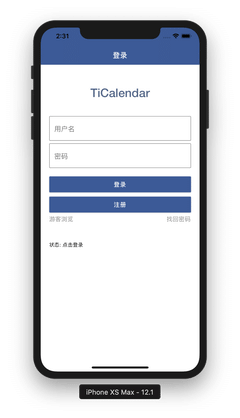

# TiCalendar📆

TiCalendar是一个智能日历应用，致力于提取网络关键信息并智能生成日历事件。

目前，TiCalendar致力于为高校学生提供便捷的日程信息获取功能，用户输入学生教务信息后，应用可以自动获取教务网站上的通知信息并获取到本地进行储存。目前，我们的应用支持同济大学学生使用。

 


## 项目适用平台

iOS 9.0+  Android 5.0+

参与代码编写：Zealoft simon0628


## 下载源码并安装应用

项目基于React Native进行编写，React Native开发环境的具体搭建请参考[React Native官方网站](https://facebook.github.io/react-native/)

开发环境搭建完成后，首先将代码克隆到本地，并借助npm工具进行安装
```shell
git clone git@github.com:TiOrg/TiCalendar.git
cd TiCalendar
npm install
```


